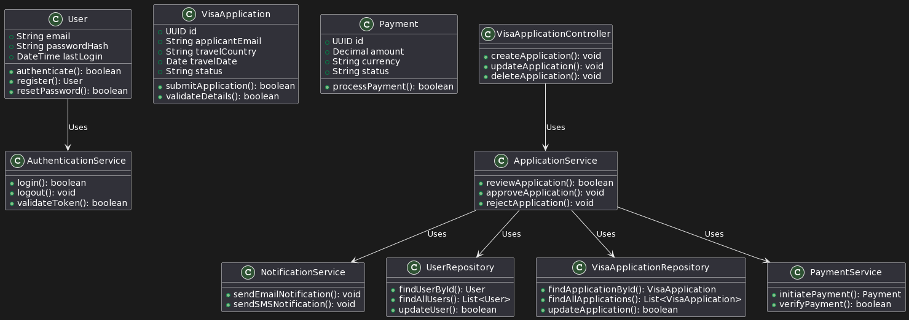

# VisApplication - Visa Application Website for Peaks of the Balkans

Welcome to VisApplication, an open-source project aimed at simplifying the visa application process for adventurers eager to explore the Peaks of the Balkans. This project is not only a tool to serve the hiking community but also a learning journey into the world of software architecture, specifically Domain-Driven Design (DDD), Clean Architecture (CA), and leveraging the capabilities of GPT and C#/.NET.

## Project Objectives
- To provide a seamless interface for users to apply for hiking visas.
- To explore and implement DDD and CA in a real-world application.
- To document the learning process and decisions in a public forum.

## Architecture Overview
The project is structured around Clean Architecture principles, ensuring our domain logic is at the core of the application's design. This approach allows us to create a system that is flexible, testable, and aligned with business goals.

## Unified Modeling Language (UML) Design

If you want to learn more about the different type of UML diagrams visit the [blog at creately.com](https://creately.com/blog/diagrams/uml-diagram-types-examples/)

### Structure Diagrams

**Profile Diagram**

Defines stereotypes and tagged values that extend the base UML model to create a domain-specific language. Use it to understand custom extensions made to standard UML to fit the project's needs.

  

  
Profile Diagram (click to expand)

  

    
  

**Domain Model Diagram**

Provides a high-level view of the conceptual model, illustrating the main entities, their attributes, and relationships within the domain. This diagram helps to clarify the real-world constructs and their interconnections, setting a foundational understanding that informs more detailed system modeling.

  

**Package Diagram**

Illustrates the organization and dependencies of different packages within a system. Read this diagram to see the system's modular structure and how high-level components are grouped.

  

**Component Diagram**

Describes the organization and interconnections of components within a system. It provides a high-level view of the system's building blocks and how they interact to provide functionality.

  

**Deployment Diagram**

Shows the physical deployment of artifacts on nodes, detailing the system's hardware and the middleware linking software components. Understand this to see how the system will be physically deployed across different machines.

  

**Composite Structure Diagram**

Outlines the internal structure of a class or a component, including its sub-parts and the interactions between them. Use this to grasp the detailed wiring and collaboration between parts of the system.

  

**Class Diagram**

Represents the static structure of the system, showing classes, their attributes, methods, and relationships. Interpret this to understand the blueprint of the system and how its data and behavior are defined.

  

**Object Diagram**

Depicts objects and their relationships at a specific point in time, giving a snapshot of the system's state. Look at this diagram to see examples of how classes and objects relate in practice.

  

### Behavioral Diagrams

**Use Case Diagram**

Shows the interactions between users (actors) and use cases, where a use case represents a unit of useful functionality. Use this to identify the functions the system should perform from an external point of view.

  

**Activity Diagram**

Models the workflow and business processes in the system, illustrating the flow from one activity to another. This diagram helps you understand the sequence and conditions for how the system operates.

  

**State Machine Diagram**

Describes the state changes that an object goes through in response to events, with each transition reflecting a change in the object's state. Use this to track the lifecycle of key entities within the system.

  

**Sequence Diagram**

Displays the sequence of messages exchanged between objects and processes over time to carry out a specific function. Read this to follow the flow of control and communication between system components for particular scenarios.

  

**Communication Diagram**

Shows the interactions between objects or parts based on their relationships and the messages they exchange. It provides an alternative to sequence diagrams, focusing on object collaboration.

  

**Interaction Overview Diagram**

  

Combines aspects of activity and sequence diagrams to give an overview of the control flow within the system, showing how different interactions fit into a larger context. Use this for a high-level map of complex sequences.

## GPT Conversations

Within the VisApplication project, GPT serves as a tool for ideation and problem-solving. It aids in the architectural design and decision-making process through interactive conversations. Here’s how it contributes to the project:

- **Design Brainstorming**: By discussing various architectural approaches and patterns, GPT helps in exploring different design solutions for the application.
- **Clarifying Concepts**: Conversations with GPT offer clarification on complex topics related to Domain-Driven Design (DDD), Clean Architecture (CA), and other software engineering principles.
- **Decision Documentation**: Dialogues with GPT are used to question and justify decisions, forming a documented trail that supports the rationale behind architectural choices.
- **Learning Enhancement**: Engaging with GPT enables a deeper understanding of .NET and C# concepts, assisting in keeping the project aligned with current best practices.

These conversations with GPT are documented and made accessible, offering insights into the thought processes behind the system’s design:

- [GPT README](docs/gpt/0-README.md): An overview of the GPT-assisted conversations shaping VisApplication.
- [Project Setup](docs/gpt/1-project_setup.md): Insights into setting up the project, as informed by GPT discussions.
- [Software Architecture and System Design](docs/gpt/2-software_architecture_and_system_design.md): A record of discussions shaping the software architecture and system design.
- [UML Design](docs/gpt/3-UML_design.md): A collection of UML diagrams inspired by conversations with GPT, illustrating the system's structure.

## GPT Conversations

- [README](docs/gpt/0-README.md)
- [Project Setup](docs/gpt/1-project_setup.md)
- [Software Architecture and System Design](docs/gpt/2-software_architecture_and_system_design.md)
- [UML](docs/gpt/3-UML_design.md)

## License
This project is licensed under the MIT License - see the [LICENSE](LICENSE) file for details.