> Author's Note
> 
> Please be aware that the UML diagrams may evolve during the development process.
> The purpose of this stage is to acquire a broad understanding of the application's architecture.
> Engaging with these diagrams could potentially reveal insights and considerations that were not initially apparent. 
> While the rendering of images directly by GPT encounters difficulties,
> the provided PlantUML syntax can be successfully visualized using [plantuml.com](https://www.plantuml.com/).

___

Q: 

This is my projects README.md

# VisApplication - Visa Application Website for Peaks of the Balkans

Welcome to VisApplication, an open-source project aimed at simplifying the visa application process for adventurers eager to explore the Peaks of the Balkans. This project is not only a tool to serve the hiking community but also a learning journey into the world of software architecture, specifically Domain-Driven Design (DDD), Clean Architecture (CA), and leveraging the capabilities of GPT and C#/.NET.

## Project Objectives
- To provide a seamless interface for users to apply for hiking visas.
- To explore and implement DDD and CA in a real-world application.
- To document the learning process and decisions in a public forum.

## Architecture Overview
The project is structured around Clean Architecture principles, ensuring our domain logic is at the core of the application's design. This approach allows us to create a system that is flexible, testable, and aligned with business goals.

## GPT Conversations

- [README](docs/gpt/0-README.md)
- [Project Setup](docs/gpt/1-project_setup.md)
- [Software Architecture and System Design](docs/gpt/2-software_architecture_and_system_design.md)

## Requirements

### Functional Requirements:

1. **User Registration and Authentication**:
    - Users must be able to register an account with the system.
    - Users must be able to authenticate with username/email and password.
    - The system should support password recovery and reset functionalities.

2. **Visa Application Submission**:
    - Provide a form for users to submit visa applications, with fields for personal details, travel information, and required documentation.
    - Validate input data for completeness and correctness.

3. **Payment Processing**:
    - Integrate a secure payment gateway for application fees.
    - Support multiple payment methods (credit/debit cards, bank transfers, etc.).
    - Provide users with payment confirmations and receipts.

4. **Application Review and Approval Workflow**:
    - Admin users must be able to review submitted applications.

5. **Status Tracking**:
    - Users should be able to track the status of their visa application in real-time.
    - Implement notifications for status updates.

6. **Help and Support System**:
    - Provide an FAQ section.

### Non-Functional Requirements:

1. **Performance**:
    - The system should handle 100 concurrent users without degradation in performance.

2. **Scalability**:
    - The system must be scalable to accommodate a growing number of users.

3. **Reliability and Availability**:
    - The system should be available with minimal downtime.

4. **Security**:
    - Adhere to best practices for data security, including encryption at rest and in transit.

5. **Maintainability**:
    - Code should be well-documented and adhere to coding standards.
    - The system should be easy to update and maintain.

6. **Usability**:
    - The user interface should be intuitive and accessible, adhering to UX/UI best practices.

7. **Testability**:
    - The system should be designed with testability in mind, with support for automated unit and integration tests.

8. **Compatibility**:
    - Ensure cross-browser compatibility and responsive design for mobile devices.

9. **Deployment**:
    - The system should support continuous integration and deployment practices.

10. **Legal and Regulatory Compliance**:
- Ensure the application complies with legal requirements, such as GDPR for users' privacy and data protection.

## Software Architecture and System Design

### Technologies:
- **Backend**: .NET Core 8 with C#12
- **Frontend**: Blazor Server

### Patterns:
- **Validation and Chain of Responsibility Pattern**: To streamline input validation and ensure each component handles its responsibility without becoming a bottleneck.
- **Decorator Pattern for Handlers**: Implement crossing concerns like logging, validation, and security in a modular way.
- **Unit of Work**: To manage database transactions, ensuring data consistency across operations.
- **CQRS (Command Query Responsibility Segregation)**: To clearly separate read and write operations, enhancing performance and scalability.
- **Outbox Pattern**: To reliably handle event dispatching and ensure eventual consistency in distributed systems.
- **Domain Events**: To facilitate communication between different parts of the application following domain-driven design principles.
- **Repository Pattern**: abstracts the data layer, providing a collection-like interface for accessing domain entities.
- **Factory Method Pattern**: Create objects without specifying the exact class of object that will be created
- **Mediator Pattern**:

### Libraries/Tools:
- **Entity Framework Core**: For ORM capabilities.
- **MediatR**: Simplifying in-process messaging between objects.
- **Automapper**: For efficient object-to-object mapping.
- **FluentValidation**: Define and execute validation rules.
- **Database**: Postgres
- **Logging**: Serilog

### Internal Services:
- **[Hangfire](https://www.hangfire.io/)**: Background processing
- **[MassTransit with RabbitMQ](https://masstransit.io/)**: Asynchronous message processing and inter-service communication.
- **[Authentication](https://learn.microsoft.com/en-us/aspnet/core/security/authentication/identity?view=aspnetcore-8.0&tabs=visual-studio) & [Authorization](https://learn.microsoft.com/en-us/aspnet/core/security/authorization/introduction?view=aspnetcore-8.0)**: .NET Individual Authentication, to manage user identities and permissions securely.
- **[API - Minimal API](https://minimal-apis.github.io/)**: Lightweight and fast APIs.
- **[Caching - Redis](https://redis.io/)**: Reduce database load and speed up response times for frequently accessed data.

### External Services:
- **[Payment Integration](https://www.mollie.com/en/)**: Mollie API, for handling a variety of payment services.
- **[Email Service](https://sendgrid.com/en-us)**: SendGrid, for reliable email sending capabilities.

### Testing:
- **Unit Testing**
    - **[xUnit](https://xunit.net/)**: for test definitions
    - **[Moq](https://github.com/devlooped/moq)**: for mocking dependencies.
- **Integration Testing**
    - **[MailDev](https://github.com/maildev/maildev)**: a simple way to test your project's generated email during development, with an easy to use web interface that runs on your machine built on top of Node.js
    - **[TestContainers](https://testcontainers.com/)**: Utilizing TestContainers to create ephemeral testing environments that mimic production setups.

### Version Control and CI/CD:
- **GIT**: Source code management
- **GitHub Actions**: Automate CI/CD pipelines

## License
This project is licensed under the MIT License - see the [LICENSE](LICENSE) file for details.

This is the url https://github.com/loran-code/VisaApplication/tree/2-system_design

I am now at the part where I want to create UML diagrams to get a better overview of how the software architecture is supposed to be created.

The high overview for the project is that a user can log in to a web application and apply for a visa for crossing the borders of Montenegro/Kosovo/Albania.

The user is able to create an account. Submit a form for applying for a visa. the user should be informed throughout the process. when the visa has successfully been submitted. when the visa has been processed and the result of the visa application should be send to the users mail address/account.

Let's start by creating a class diagram.

___

A:

Let's start crafting the class diagram for the VisApplication project. Given the detailed requirements and software architecture you've described, the diagram will include several key components such as user management, visa application processing, payment handling, and notification systems. I'll include important classes along with their attributes and methods that define the relationships and responsibilities in the context of the application.

Here's an overview of the classes we might consider:

1. **User**: Manages user information and authentication.
2. **VisaApplication**: Represents a visa application form submitted by a user.
3. **Payment**: Handles payment transactions.
4. **NotificationService**: Manages sending notifications to users.
5. **ApplicationService**: Core service handling the business logic of application processing.
6. **AuthenticationService**: Manages user login and security.
7. **VisaApplicationController**: The API controller that handles HTTP requests related to visa applications.
8. **UserRepository**: Interface to the user data.
9. **VisaApplicationRepository**: Interface to the visa application data.
10. **PaymentService**: Interface to payment gateway integration.

Below is the PlantUML code that represents the class diagram for these components:

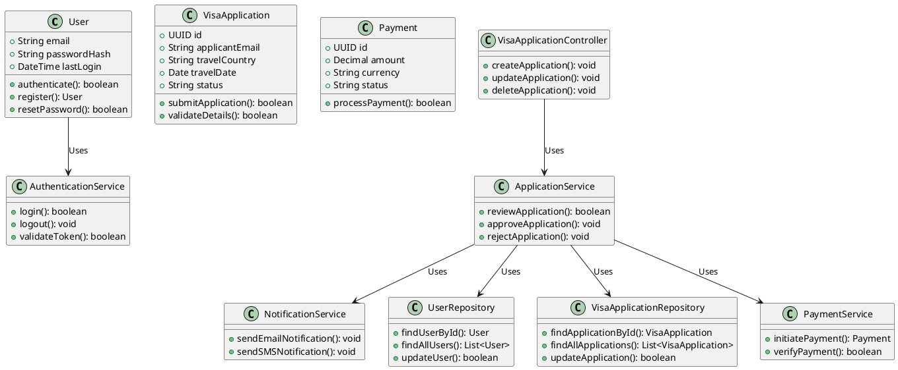

---

Q:

Continue with the component diagram

---

A:

Let's proceed with designing a component diagram for the VisApplication project. This diagram will focus on illustrating the different components of your application, their interactions, and how they are organized within the overall system architecture, aligned with the Clean Architecture and Domain-Driven Design principles you're employing.

Here's an outline of the main components that we can include in your diagram:

1. **Web Interface (UI)**: The front-end part of the application where users interact.
2. **Controllers**: Manages user requests, orchestrating user input and application responses.
3. **Application Services**: Serves as the coordination layer handling business logic.
4. **Domain Model**: Encapsulates the core business logic and rules.
5. **Repository Interfaces**: Provides an abstraction layer for data access.
6. **Infrastructure Services**: Supports the system with technical capabilities like logging, caching, and external API communications.
7. **Database**: Stores user and application data persistently.
8. **External Services**: Such as payment gateways and email services.

Here's the PlantUML code you can use:

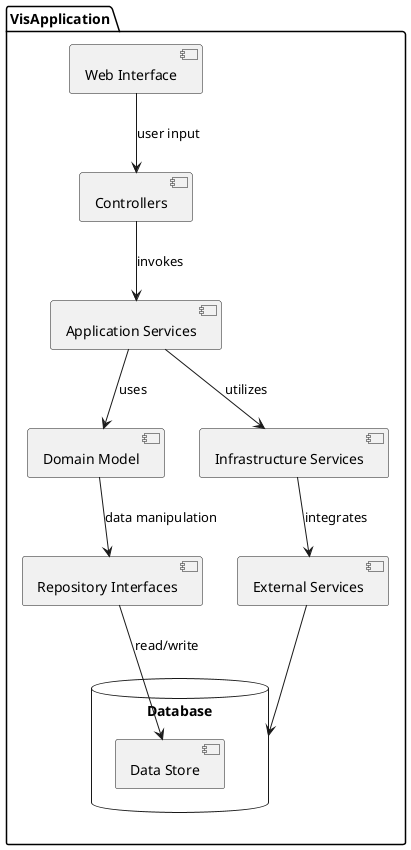

You can paste this code into any PlantUML editor to generate the diagram. If you need help with any other aspect of your design or further UML diagrams, please let me know!

---

Q:

Continue with the Object Diagram

---

A:

Let's create an object diagram for a specific scenario within the VisApplication project. Object diagrams are useful for illustrating examples of data structures at a particular moment in time, based on the class models. For VisApplication, I'll focus on a typical use case of a user applying for a visa, including instances of user authentication, visa application submission, payment processing, and notification sending.

Here's a description of the scenario:

1. **User** logs into the system.
2. **User** submits a visa application.
3. **Payment** is processed.
4. **Notification** is sent upon successful submission and payment.

### Objects and Their Links:

- **User Object**: Represents the logged-in user.
- **VisaApplication Object**: Represents the application submitted by the user.
- **Payment Object**: Represents the payment transaction for the visa application fee.
- **Notification Object**: Represents the notification sent to the user about the status of their application.

Here's the PlantUML code to visualize this scenario:

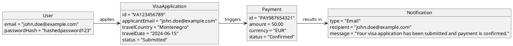

This diagram shows the objects involved in the visa application process and how they are interrelated. 

If you need further assistance or another type of diagram, feel free to ask!

---

Q:

Continue with a Profile Diagram

---

A:

Creating a UML Profile Diagram involves defining stereotypes, tagged values, and constraints that tailor UML to specific domains or platforms. Profile diagrams are especially useful for adapting UML to particular purposes, extending the UML language to cover specific needs. In the context of your VisApplication project, we can define a UML profile to accommodate certain aspects specific to the application domain, such as specific security, performance, or regulatory requirements.

Let’s consider some potential stereotypes and tagged values that might be relevant for the VisApplication system, particularly focusing on areas like security and compliance which are critical for a visa application system.

### Stereotypes:
- **<<Secure>>**: Could be applied to components or operations that require special security considerations (e.g., user authentication, payment processing).
- **<<GDPRCompliant>>**: Applied to components or classes that handle personal data, ensuring they adhere to GDPR guidelines.
- **<<Asynchronous>>**: Used for services or operations that are performed asynchronously, like sending notifications or processing payments.

### Tagged Values:
- **concurrencyLevel**: An attribute that can be attached to components to specify how many concurrent users they are expected to support.
- **encryptionLevel**: Specifies the level of encryption required for storing or transmitting data.

### Example Profile Diagram:
We'll create a simple profile diagram to illustrate how you might define these stereotypes and tagged values within the context of your application:

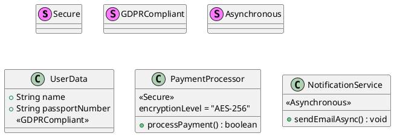

This profile diagram defines the stereotypes and shows how they might be applied to specific classes in your application.

By tailoring a UML profile to the specific needs of your project, you can make your UML diagrams more expressive and relevant to stakeholders, and ensure that your design documentation directly supports your architectural decisions. If you need further details on how to apply this profile or how to adapt it for other aspects of your application, feel free to ask!

---

Q:

Continue with Composite Structure Diagram

---

A:

Creating a Composite Structure Diagram for the VisApplication project will help illustrate the internal structure and interaction of parts within a component or a set of components. This type of diagram is useful for detailing the runtime collaborations between parts that collectively achieve the system's functionality, particularly in a complex system like an online visa application platform.

### Scenario Overview

For VisApplication, let's consider the component that handles the visa application process. This component will involve sub-components like user authentication, visa application form handling, payment processing, and notification dispatching. Each of these parts plays a role in handling a visa application, and they interact with one another to complete the process.

### Composite Structure Diagram Elements

- **VisaApplicationComponent**: The main component that orchestrates the visa application process.
   - **UserAuthentication**: Responsible for user identification and security.
   - **ApplicationFormHandler**: Manages the intake and validation of application forms.
   - **PaymentProcessor**: Handles payment transactions.
   - **NotificationManager**: Sends out notifications related to application status.

### PlantUML Code

Here's the PlantUML code that represents the composite structure for this scenario:

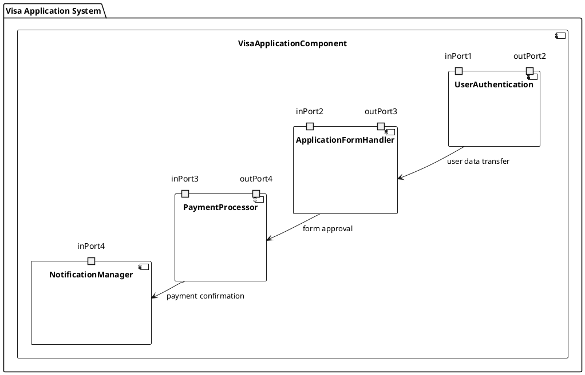

This diagram will help you visualize the internal structure of the VisaApplicationComponent and how its parts interact to manage the visa application process.

If you need further details or adjustments to the diagram, please let me know!

---

Q:

Create a Use Case Diagram

---

A:

For the VisApplication project, creating a Use Case Diagram will help visually represent the interactions between various types of users and the system itself, focusing on the functional requirements you've outlined. Let's detail the primary use cases for the users interacting with your visa application system.

### Actors:
1. **Applicant**: A user applying for a visa.
2. **External Entity**: The office in the destination country that reviews the visa applications.

### Use Cases:
- **Register Account**: Allows an applicant to create a user account.
- **Log In**: Enables applicants to authenticate into the system.
- **Submit Visa Application**: Applicants can fill out and submit their visa applications.
- **Pay Application Fee**: Applicants handle the payment of visa application fees.
- **Track Application Status**: Applicants can view the current status of their applications.
- **Receive Notifications**: Applicants receive updates about their application status from the system.
- **Review Visa Application**: The external entity reviews submitted visa applications.
- **Send Review Results**: The external entity sends the results back to the VisaApplication app.

### PlantUML Code for the Updated Use Case Diagram:
Here is the revised PlantUML code to visualize these use cases and actor interactions:

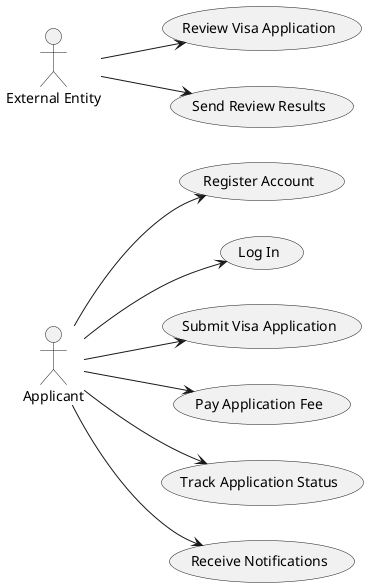

This diagram includes the external entity and their role in the visa application process, showing a clear separation between the applicant's interactions with the VisApplication system and the external entity's responsibilities.

If you have any more adjustments or need further assistance, let me know!

---

Q:

Continue with the activity diagram

---

A:

To create an Activity Diagram for the VisApplication project, we'll focus on the process of a user applying for a visa. This will include activities from the moment a user decides to apply for a visa to when they receive the decision on their application. The diagram will capture sequential and conditional activities, showing the flow from one activity to another.

### Scenario Overview:
1. **User Registration**: The user creates an account.
2. **User Login**: The user logs into their account.
3. **Fill Out Visa Application Form**: The user enters required information.
4. **Submit Visa Application**: The application is submitted to the system.
5. **Process Payment**: Payment for the visa application fee is processed.
6. **Application Review by External Entity**: The external entity reviews the application.
7. **Receive and Notify Decision**: The system receives the decision and notifies the user.

### PlantUML Code for the Activity Diagram:
Here's the PlantUML code to visualize the activity flow in the visa application process:

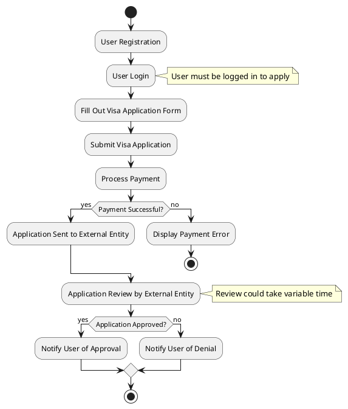

This diagram will help you visualize the user's journey through the visa application process within your application, including decision points such as the success of the payment and the outcome of the external review.

This activity diagram is designed to provide a clear overview of the visa application process, highlighting key activities and decisions. If you need additional details or modifications to better fit your project needs, please let me know!

---

Q:

Continue with State Machine Diagram.

---

A:

To design a State Machine Diagram for the VisApplication project, we can focus on the lifecycle of a visa application within your system. This diagram will illustrate the various states that a visa application can go through from initiation to conclusion, including transitions based on events and conditions.

### States of a Visa Application:
1. **Created**: The initial state after a user fills out and submits the visa application form.
2. **Submitted**: The state after the application is officially submitted and awaiting payment processing.
3. **Payment Processed**: Occurs when the payment is successfully processed.
4. **Under Review**: The application has been sent to the external entity for review.
5. **Approved**: The application is approved by the external entity.
6. **Denied**: The application is denied by the external entity.
7. **Cancelled**: The user cancels the application before it is reviewed.

### Events and Transitions:
- **Submit Application**: Transitions from Created to Submitted.
- **Complete Payment**: Transitions from Submitted to Payment Processed.
- **Forward to Review**: Transitions from Payment Processed to Under Review.
- **Review Complete**: Depending on the outcome, transitions to either Approved or Denied.
- **Cancel Application**: Can transition from Created, Submitted, or Payment Processed to Cancelled.

### PlantUML Code for the State Machine Diagram:
Here is the PlantUML code to create a State Machine Diagram representing the lifecycle of a visa application:

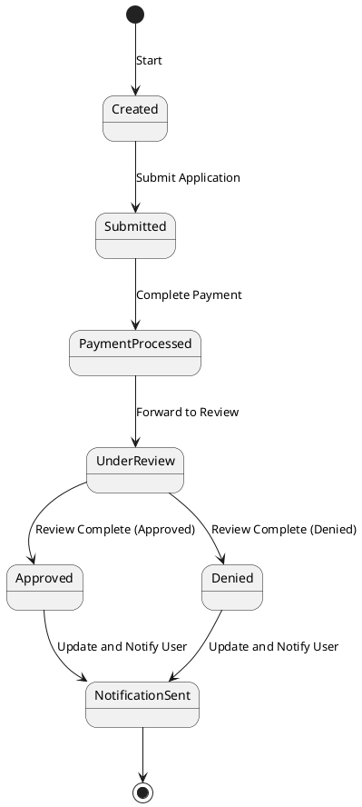

This diagram visualizes the transitions between the different states of a visa application, guided by user actions and system events.

If you need adjustments to this diagram or additional diagrams to further illustrate other parts of your system, feel free to ask!

---

Q:

Continue with a Sequence Diagram

---

A:

For the VisApplication project, let's create a Sequence Diagram that outlines the sequence of interactions between objects for the use case where a user submits a visa application and the system processes it up to the point where the external entity sends back the review results.

### Scenario Steps:
1. **User** initiates the visa application submission process.
2. **System** prompts for user authentication.
3. **User** authenticates.
4. **System** provides the visa application form.
5. **User** submits the completed form and payment information.
6. **PaymentService** processes the payment.
7. **VisaApplicationService** sends the application to the external entity.
8. **External Entity** reviews the application.
9. **VisaApplicationService** receives the review results.
10. **NotificationService** informs the user of the decision.

### PlantUML Code for the Sequence Diagram:
Here's the PlantUML code to visualize the sequence of interactions based on the steps mentioned:

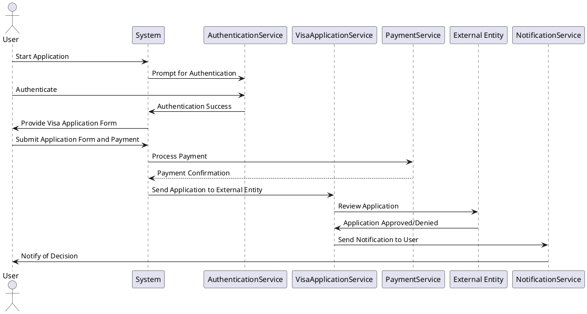

This sequence diagram captures the interactions and flow of control from the user submitting a visa application to receiving the review decision notification.

If you need the diagram to reflect a different sequence or additional steps, let me know so I can adjust it accordingly!

---

Q:

Continue with Communication Diagram

---

A:

A Communication Diagram in UML illustrates the interactions between objects or parts of a system that collaborate to achieve a specific goal, focusing on the relationships and message flow within the system. For the VisApplication project, the communication diagram will depict the interactions for the visa application process similarly to the sequence diagram but will focus on the connections and message flow between the objects.

### Scenario Overview:
The same steps from the sequence diagram apply here:
1. User authenticates and submits the visa application.
2. The system processes the payment.
3. The visa application is sent to the external entity.
4. The application review result is received.
5. The user is notified of the decision.

### PlantUML Code for the Communication Diagram:
Here's the PlantUML code to represent the communication between the system's components during the visa application process:

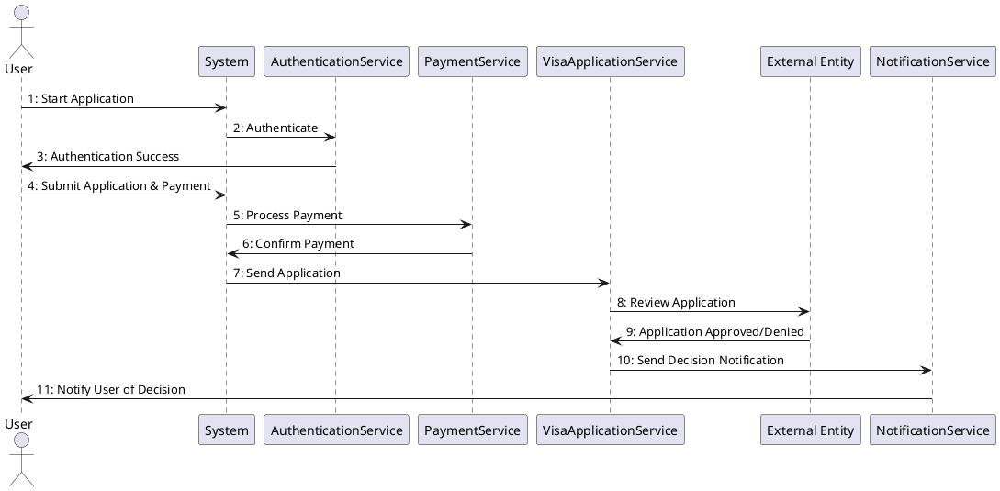

Each numbered message corresponds to a step in the process. This diagram emphasizes the interactions and the objects that communicate with each other, giving a clear view of the message flow for the process.

Adjustments can be made to the diagram if there are more details about the interactions that need to be captured or if there are additional steps or objects involved. Let me know if you have specific requirements or if there's anything else you'd like to add!

---

Q:

Create a Deployment diagram

---

A:

A Deployment Diagram in UML models the physical deployment of artifacts on nodes. For the VisApplication project, the deployment diagram can show the setup of your servers, the various services running on them, and how they might be connected.

### Deployment Diagram Elements:
1. **Web Server**: Hosts the web application interface.
2. **Application Server**: Runs the application logic (e.g., Blazor Server for frontend, .NET Core backend).
3. **Database Server**: Hosts the PostgreSQL database.
4. **External Services**: Represents third-party services like payment gateway, email service.
5. **Client Devices**: Users' devices connecting to the application.

### PlantUML Code for the Deployment Diagram:
Here's the PlantUML code that represents the deployment of the VisApplication:

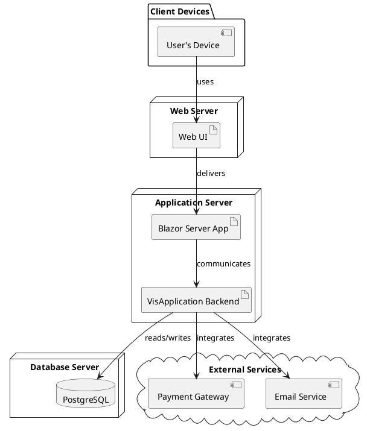

In this diagram:
- **Client Devices** represent the user's entry point into the system.
- **Web Server** serves the web UI, typically hosted on platforms like IIS, Nginx, or Apache.
- **Application Server** contains your backend logic and Blazor server application.
- **Database Server** holds the data persistently.
- **External Services** are third-party systems that provide payment and email functionalities.

This code is for a basic setup. The diagram should illustrate the physical deployment of the application components and how they interact.

If your deployment has more components or you need a more detailed diagram, let me know the specifics, and I can expand the diagram accordingly!

---

Q:

Create a Interaction Overview Diagram

---

A:

An Interaction Overview Diagram in UML is a type of activity diagram in which nodes are interactions or interaction uses. It shows a high-level view of the control flow between various interaction diagrams (like sequence, communication, timing, etc.) that detail the system's operations. For VisApplication, we can outline the interaction overview of a user submitting a visa application and the system's subsequent actions to process this application.

### Interaction Overview Diagram Elements:
1. **Start**: The initiation of the visa application process.
2. **Authenticate User**: A sequence or communication diagram detailing user authentication.
3. **Submit Application**: A sequence or communication diagram detailing visa application submission.
4. **Process Payment**: A sequence or communication diagram for payment processing.
5. **Application Review**: A sequence or communication diagram for the external entity reviewing the application.
6. **Notify User**: A sequence or communication diagram for notifying the user of the decision.
7. **End**: The conclusion of the visa application process.

### PlantUML Code for the Interaction Overview Diagram:
Here's the PlantUML code representing the interaction overview for the visa application process:

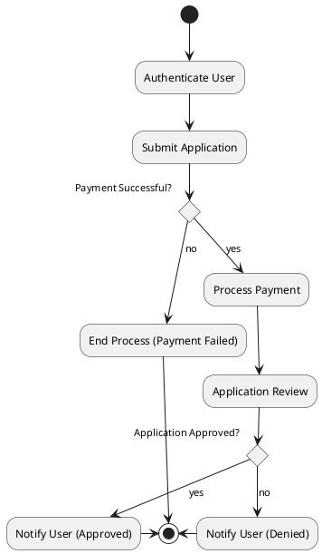

In this diagram:
- Each named rectangle ("Authenticate User", "Submit Application", etc.) can represent an entire sequence or communication diagram that would detail that part of the process.
- Decision points ("Payment Successful?", "Application Approved?") lead to different flows based on the outcome of those points.

The PlantUML code creates a high-level overview showing the control flow, with forks in the process depending on conditions encountered during the application and review stages.

Interaction Overview Diagrams can get complex quickly as they reference other detailed diagrams, but they are excellent for providing a 'map' of the overall interaction flow in a system. If you need to drill down into more details or add more interactions, just let me know the specifics!

---

Q:

> I've decided to copy paste the complete chat back into a fresh GPT conversation asking the following question

This is a readme on my UML design chat with GPT. Would you add/change anything?

A:

Your UML diagrams and their detailed descriptions cover a comprehensive view of the VisApplication project, providing a solid foundation for understanding and documenting the system architecture and behavior. Here are a few suggestions to enhance or extend your current UML documentation:

1. **Integration Details**:
    - For **sequence diagrams** and **communication diagrams**, consider detailing the interaction with external services more thoroughly, such as how the application handles API failures, retries, or fallbacks when interacting with payment gateways or email services.
    - You might also want to illustrate how the application handles asynchronous operations, especially with external services that don't respond immediately.

2. **Security Aspects**:
    - Adding more details about security processes in the **sequence** and **state machine diagrams** could be beneficial. For instance, showing how authentication tokens are refreshed or how security checks are performed before sensitive actions are executed.

3. **Error Handling**:
    - Introduce **activity diagrams** or **state machine diagrams** that focus on error handling and recovery processes. This could include how the system handles form validation errors, payment failures, or unexpected system faults.

4. **Scalability and Performance**:
    - For the **deployment diagram**, consider showing scaling strategies—such as load balancers, multiple application server instances, and database replication. This would be particularly useful given the non-functional requirement for handling 100 concurrent users.

5. **Mobile and Responsive Aspects**:
    - If your application supports mobile devices or needs to be responsive, including a **deployment diagram** or **component diagram** that shows mobile clients and their interactions with backend services could be useful. This might highlight different UI components or services tailored to mobile platforms.

6. **Advanced UML Features**:
    - Utilize UML **profiles** to define custom stereotypes that are specific to your domain, such as <<Cacheable>>, <<HighAvailability>>, or <<HighLoad>>. These can help in quickly identifying the components or operations that have special requirements related to performance, availability, or scalability.

7. **Comprehensive Testing Scenarios**:
    - An **interaction overview diagram** that integrates different testing scenarios could be beneficial. This diagram could outline how unit tests, integration tests, and user acceptance tests interact with the various components of the system.

These enhancements can help in not only providing a deeper understanding of the system but also in addressing specific technical and business concerns that might be critical for stakeholders. If you would like to see examples of any of these suggestions or need further modifications, please let me know!